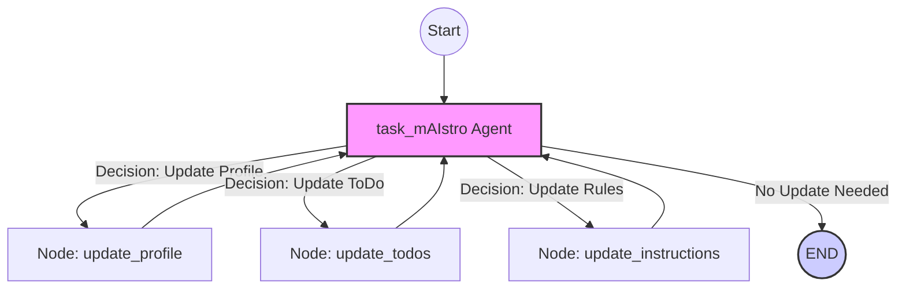

Memory is foundational for building truly context-aware and personalized AI applications. We explore how to construct a robust **Memory Agent** from [langgraph](https://github.com/langchain-ai/langchain-academy/blob/main/module-5/memory_agent.ipynb), that utilizes `langgraph` for orchestration and `Trustcall` for structured memory management,. This agent not only remembers facts but also decides *when* to save new information and *how* to use it.


## 🌐 High-Level Architecture: From Stateless to Stateful

Memory agent called `task_mAIstro` acts as a central orchestrator that transforms an LLM into a context-aware system. It differentiates itself through four architectural pillars:

  * **Contextual Persistence:** It implements a tiered memory system (Semantic, Episodic, Procedural).
  * **Dynamic Routing:** It utilizes a graph-based state machine to determine *when* to write to memory versus *when* to simply respond.
  * **Verifiability:** It rejects "black box" memory in favor of inspectable, structured storage.
  * **Composability:** built on the `langgraph` framework, allowing for modular extension.

### The Execution Flow

1.  **Ingestion:** User input enters the system.
2.  **Cognitive Routing:** A decision tool (`UpdateMemory`) analyzes the intent. Does this input require a change to the user's profile, the task list, or the rules of engagement?
3.  **State Transition:** The graph routes the state to a specific update node (`update_profile`, `update_todos`, etc.).
4.  **Consolidation:** Data is committed to the `InMemoryStore` (Long-term) or `MemorySaver` (Short-term/Thread-level).
5.  **Feedback Loop:** The system verifies the write operation via internal "Spy" listeners or external user confirmation.

-----

## 🧠 The Taxonomy of AI Memory

To build a truly intelligent agent, we must move beyond a generic "context window." `task_mAIstro` segments data into three distinct cognitive categories, mimicking human memory systems:

| Memory Type | Cognitive Equivalent | Description | Data Structure |
| :--- | :--- | :--- | :--- |
| **Semantic** | **User Profile** | General facts and static knowledge about the user (Who they are). | `Profile` Schema |
| **Episodic** | **ToDo List** | Temporal, event-based memory tracking specific tasks and states (What they need to do). | `ToDo` Schema |
| **Procedural** | **Instructions** | Implicit rules and preferences governing *how* the agent should behave. | String / List |

### Structured Schema Definitions

By using Pydantic, we enforce strict typing on our memory, preventing hallucinations from corrupting the agent's long-term state.

```python
from pydantic import BaseModel, Field
from typing import Optional, Literal, List
from datetime import datetime

# Semantic Memory (The "Who")
class Profile(BaseModel):
    name: Optional[str] = Field(description="User's preferred name")
    location: Optional[str] = Field(description="Current geographical context")
    job: Optional[str] = Field(description="Professional role")
    interests: List[str] = Field(description="Topics of engagement")

# Episodic Memory (The "What")
class ToDo(BaseModel):
    task: str = Field(description="Actionable item")
    deadline: Optional[datetime] = Field(description="Hard constraint for completion")
    solutions: List[str] = Field(description="Proposed pathways to completion")
    status: Literal["not started", "in progress", "done", "archived"]

# Procedural Memory is handled via raw instruction strings injection.
```

-----

## 🔗 The `StateGraph`: Orchestrating Cognition

The nervous system of `task_mAIstro` is the **StateGraph**. This defines the deterministic flows between reasoning and memory updates.

Unlike a linear chain, this graph allows for **conditional branching**:

```python
from langgraph.graph import StateGraph, END
from typing import TypedDict, Literal

# Define the State schema to track routing intent
class AgentState(TypedDict):
    update_type: Literal["user", "todo", "instructions", "none"]
    messages: list

# Initialize the Graph
builder = StateGraph(AgentState)

# 1. Define Nodes (The Functional Units)
builder.add_node("task_mAIstro", task_mAIstro_agent)
builder.add_node("update_profile", update_profile_tool)
builder.add_node("update_todos", update_todos_tool)
builder.add_node("update_instructions", update_instructions_tool)

# 2. Define Conditional Routing (The Logic)
def route_memory(state: AgentState):
    """Determines which memory subsystem requires an update."""
    return state.get("update_type", "none")

builder.add_conditional_edges(
    "task_mAIstro", 
    route_memory,
    {
        "user": "update_profile",
        "todo": "update_todos",
        "instructions": "update_instructions",
        "none": END
    }
)

# 3. Define Re-entry (The Feedback Loop)
# After memory is updated, loop back to the agent to confirm or continue
builder.add_edge("update_profile", "task_mAIstro")
builder.add_edge("update_todos", "task_mAIstro")
builder.add_edge("update_instructions", "task_mAIstro")

# 4. Compile
builder.set_entry_point("task_mAIstro")
graph = builder.compile()
```

-----

## 📊 Visualizing the Logic Flow

The following Mermaid diagram illustrates the cyclical nature of the agent's memory update process. Note the closed feedback loops that ensure the agent remains aware of its own memory modifications.



-----

## ✅ Trust and Verification

A memory system is only as good as its accuracy. `task_mAIstro` implements a "Trust but Verify" protocol:

1.  **Observability (The "Spy"):**
    We attach a listener to the tool execution stream. This allows developers to inspect the raw `PatchDoc` calls—seeing exactly how the JSON patch was applied to the memory store.

    > *Log Output:* `Document 0 updated: Plan: Replace 'location' value. Result: 'Sammamish, WA'`

2.  **Explicit User Confirmation:**
    For high-stakes episodic memory (like modifying a deadline), the agent is instructed to request verbal confirmation before committing the state change.

3.  **Direct Store Inspection:**
    Developers can bypass the agent simulation and query the KV (Key-Value) store directly to debug state issues.

    ```python
    # Direct access to the instruction namespace for user 'Lance'
    current_rules = across_thread_memory.get(("instructions", "Lance"))
    ```

-----

## 🚀 Conclusion

`task_mAIstro` represents a shift from **reactive** AI to **accumulative** AI. By unifying semantic, episodic, and procedural memory into a single graph-based architecture, we create agents that do not just process tokens—they build relationships and maintain continuity.

This architecture balances the flexibility of LLMs with the rigidity required for reliable software, ensuring your agent becomes a long-term partner rather than a fleeting conversationalist.
